# ilo Jutu pona la lipu pi pana sona (instructions Chrome extension for YouTube Live chat chrome extension)

## Features
The Chrome extension automatically formats Toki Pona messages in Sitelen Pona using nasin-nanpa.otf. It is permissive of many tp word variations, allows for custom YouTube emotes, and formats any unofficial 'proper words' with Comic Sans. 

To better display chat messages for incorporation into live-stream overlays, profile pictures are removed, as well as additional padding around individual messages. Deleted messages are removed altogether instead of censored with `[message retracted]`.

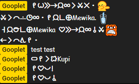

## Installing
1. Download the source code.
2. You'll need to have Chrome installed; navigate to `chrome://extensions/`. 
3. Toggle on "Developer mode" in the top-right. 
4. Click on "Pack extension". Leave blank the optional "Private key file", and just browse for the "Extension root directory", which is wherever you downloaded this extension's code to. It probably is in a directory ending with `...\ilo-Jutu-pona`. Click "Pack extension" to confirm. 
5. Click "Load unpacked", selecting the same directory. 

When properly loaded, you should see this on the chrome extensions page:

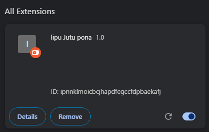

## Using the extension
The extension only works on the popout chat window. Click the 3-dot menu in the top right, and select "popout chat". 

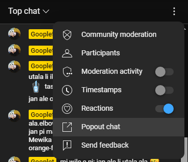

(Tip: you can popout chat before going live by navigating to the broadcast in YouTube studio).

Alternatively, you can navigate directly to the "popout" chat page if you have your broadcast's video ID: `https://studio.youtube.com/live_chat?is_popout=1&v=VIDEOID`

Since you are still viewing chat in a browser, you can easily increase and decrease the font size to get the best possible appearance and legibility for your purposes using `ctrl-shift-[ + or - ]`, or simply holding `ctrl` and scrolling. 

## Incorporating chat into OBS
In the Sources panel in OBS, click the + button and select "Window capture"

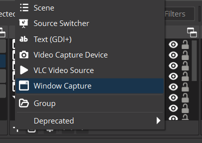

Give it a unique and easily-recognizable name. 

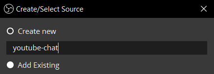

Select the chat window. You can resize the chat browser itself so it displays exactly the amount of chat that you'd like. 

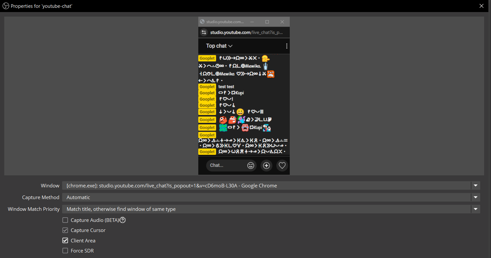

You've added the chat to your OBS scene! You can now resize, move, and crop it as you like. Hold `alt` and drag the resize handles around the image to easily crop the top and bottom of the chat window.

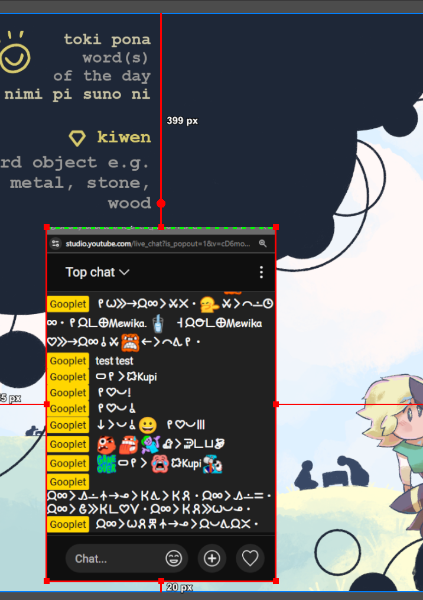

For greatest clarity, I'd recommend not resizing the OBS object but rather the Chrome browser window itself, and adjusting text size there. Just crop the window appropriately in OBS, and you're set!

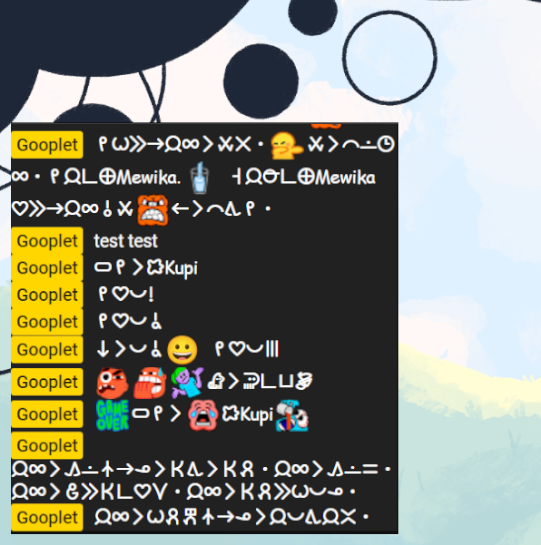

## Credits
I'd like to thank jan Kekan San for all his input throughout the process of creating this extension!! His insights into detecting and formatting toki pona messages were invaluable. 

This project uses [nasin-nanpa-3.1.0.otf](https://github.com/ETBCOR/nasin-nanpa).

is-toki-pona.js was generously contributed by [m4ym4y](https://github.com/m4ym4y) since I was clueless about regex.

### Bonus
Here are some pictures of my cats Denna and Kvothe as well as Henry the skull with a corncob pipe
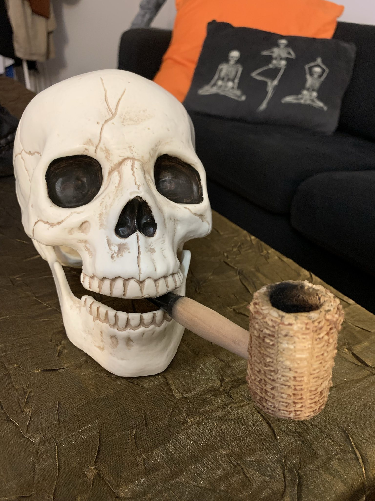
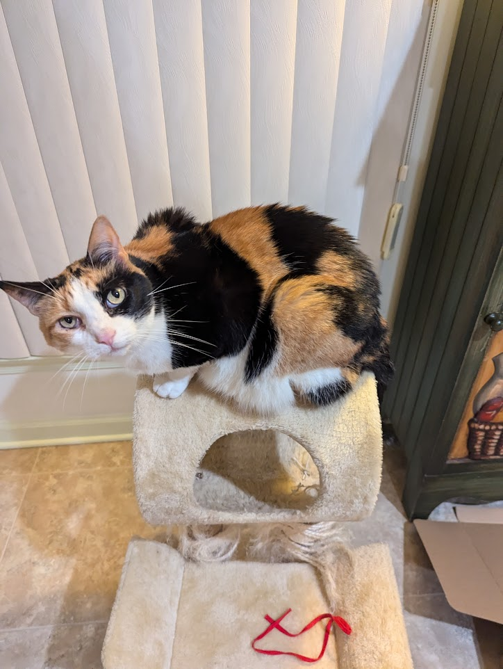
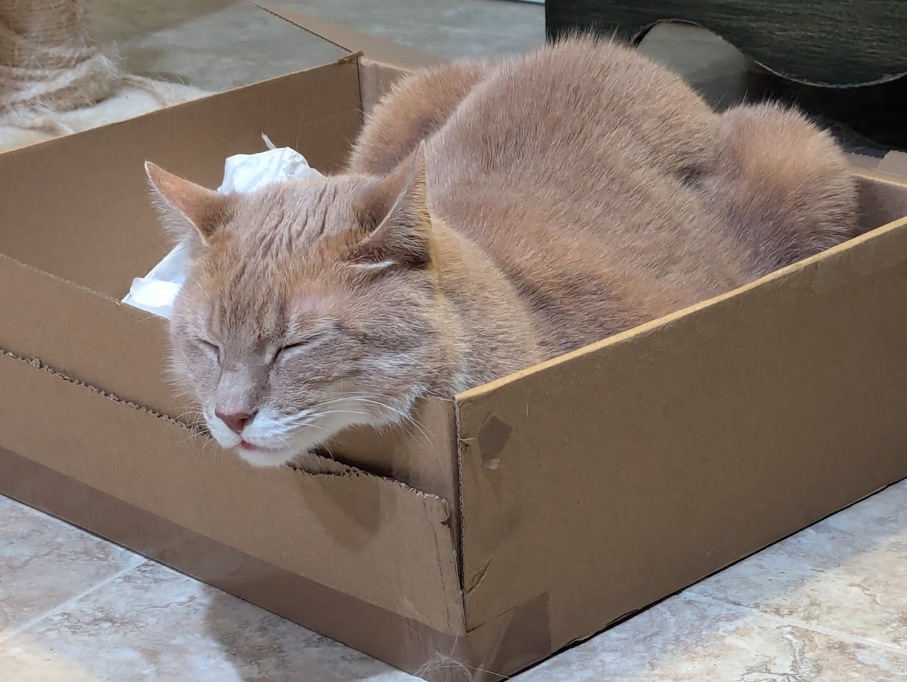